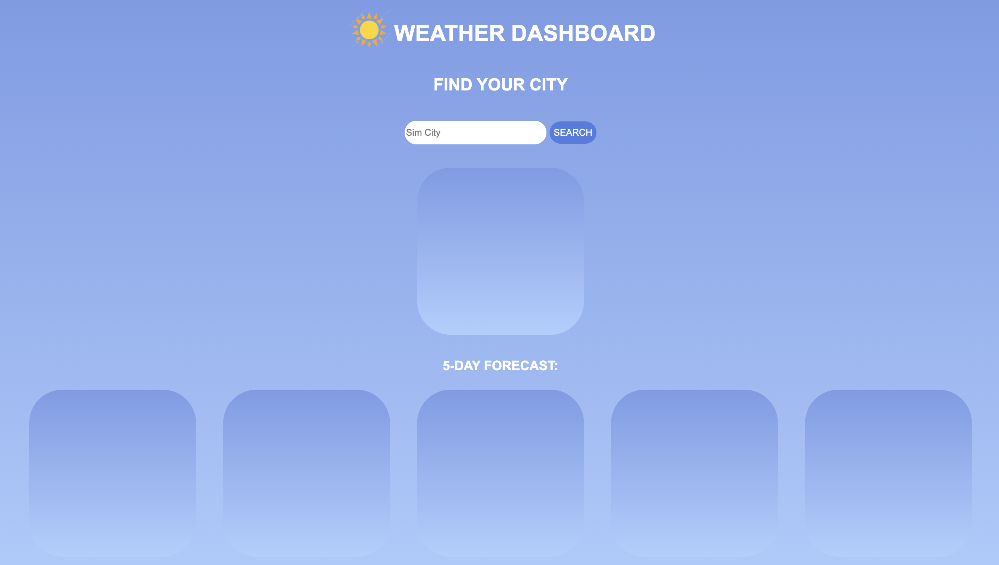
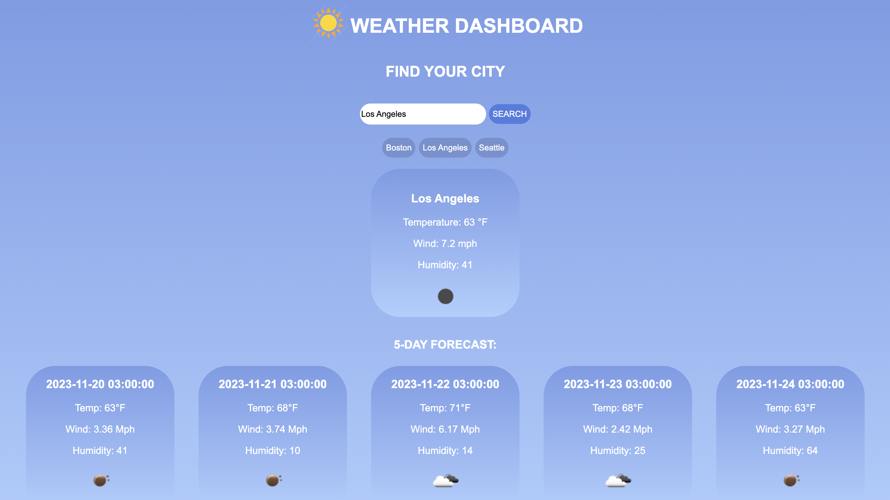

# weather-api

Weather Dashboar utilizes Open Weather Map API to display the forecast of weather over the next 5 days. It was created using html, css, and js and utlizes local storage to remember which cities users have looked up in the past.

## Installation

git clone https://github.com/jamu-bu/weather-api.git
or visit the deployed site at https://jamu-bu.github.io/weather-api/

## Usage
When the page first loads in you will see this

Once you insert the name of the city you are looking for into the search bar, results will populate with the weather for the next 5 days

Additionally, the most recently searched for cities which are stored in local storage also display as buttons

## License

[MIT](https://choosealicense.com/licenses/mit/)